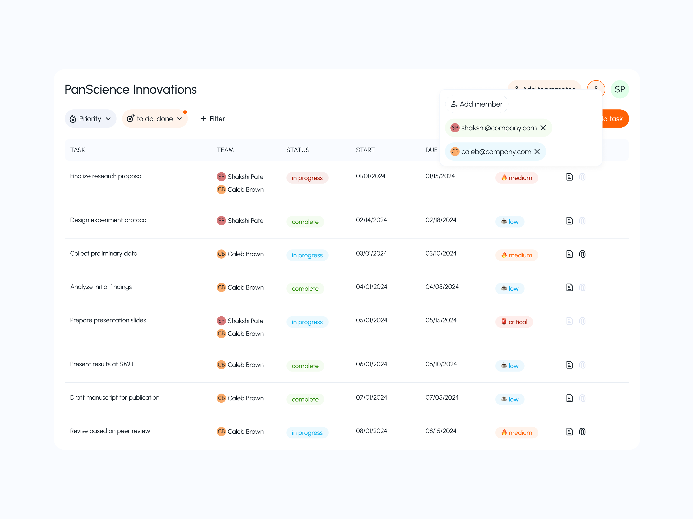

<p align="center">
  
</p>

# Task Management Application

A full-stack task management application built with React, TypeScript, and Bun. This application provides a modern interface for managing tasks with user authentication, role-based access control, and file attachment capabilities.

## 🚀 Features

### User Management
- **User Registration & Authentication**: Secure user registration and login system with JWT-based authentication
- **Role-Based Access Control (RBAC)**: Support for admin and user roles with different permission levels
- **User Profile Management**: View and manage user profiles

### Task Management
- **Create & Manage Tasks**: Create, update, and organize tasks with rich details
- **Task Status Tracking**: Track tasks with statuses: `late`, `done`, `progress`
- **Priority Levels**: Assign priority to tasks: `low`, `medium`, `high`, `urgent`
- **Due Date Management**: Set and track task deadlines
- **File Attachments**: Attach PDF documents to tasks
- **Task Assignment**: Assign tasks to multiple users
- **Pagination Support**: Efficiently browse through large task lists

### File Management
- **PDF Upload**: Upload PDF files with validation
- **File Storage**: Secure file storage system
- **File Listing**: View all uploaded files

## 🏗️ Architecture

This is a monorepo containing two main applications:

```
panscience-innovation/
├── client/          # React frontend application
├── server/          # Bun/Express backend API
└── README.md        # This file
```

### Technology Stack

#### Frontend (`client/`)
- **Framework**: React 19 with TypeScript
- **Build Tool**: Vite (with Rolldown)
- **State Management**: Redux Toolkit
- **Routing**: React Router v7
- **Styling**: SCSS modules
- **UI Features**: 
  - React Compiler for optimized rendering
  - Hot Module Replacement (HMR)
  - SVG icon system with dynamic generation
  - Toast notifications

#### Backend (`server/`)
- **Runtime**: Bun
- **Framework**: Express.js
- **Database**: PostgreSQL with Prisma ORM
- **Authentication**: JWT tokens
- **File Upload**: Multer
- **Security**: Helmet, CORS
- **Logging**: Winston with daily rotation
- **Password Hashing**: bcrypt

## 📋 Prerequisites

- **Node.js** (v18 or higher) or **Bun** (v1.2.14 or higher)
- **PostgreSQL** (v17 or higher)
- **Git**

## 🛠️ Installation & Setup

### 1. Clone the Repository

```bash
git clone https://github.com/shakshipatel/panscience-innovation.git
cd panscience-innovation
```

### 2. Setup Backend (Server)

```bash
cd server

# Install dependencies
bun install

# Configure environment variables
cp .env.example .env
# Edit .env with your database credentials

# Run database migrations
bunx prisma migrate deploy
bunx prisma generate

# Start development server
bun run dev
```

The server will run on `http://localhost:3000`
If testing on postman, use this as base url `http://localhost:3000/v1`

### 3. Setup Frontend (Client)

```bash
cd client

# Install dependencies
bun install

# Start development server
bun run dev
```

The client will run on `http://localhost:5173`

## 🐳 Docker Deployment

The application can be deployed using Docker Compose:

```bash
cd server

# Start all services (app + database)
docker-compose up -d

# View logs
docker-compose logs -f

# Stop services
docker-compose down
```

This will start:
- Backend API on port 3000
- PostgreSQL database on port 5432

## 📡 API Endpoints

### Authentication

```
POST   /v1/user/register    # Register new user
POST   /v1/user/login       # User login
GET    /v1/user/me          # Get current user (requires auth)
GET    /v1/user/all         # Get all users (requires auth)
```

### Task Management

```
POST   /v1/task             # Create task (requires auth)
GET    /v1/task/:id         # Get task by ID (requires auth)
GET    /v1/task             # Get all tasks (requires auth)
POST   /v1/task/page        # Get paginated tasks (requires auth)
PUT    /v1/task             # Update task (requires auth)
```

### File Upload

```
POST   /v1/upload           # Upload PDF file
GET    /v1/files            # List all uploaded files
```

## 🗄️ Database Schema

### User Model
- `id`: UUID (Primary Key)
- `name`: String
- `email`: String (Unique)
- `password`: String (Hashed)
- `role`: Enum (admin, user)
- `createdAt`: DateTime
- `updatedAt`: DateTime

### Task Model
- `id`: UUID (Primary Key)
- `title`: String
- `description`: String (Optional)
- `status`: Enum (late, done, progress)
- `priority`: Enum (low, medium, high, urgent)
- `dueDate`: DateTime (Optional)
- `attachedDocuments`: String[]
- `users`: User[] (Many-to-many relation)
- `createdAt`: DateTime
- `updatedAt`: DateTime

#### 🧪 Demo Admin Credentials

To explore the application with admin privileges, use the following test account:

```bash
Email:    panscience@gmail.com
Password: admin@panscience
Role:     admin
```

## 🎨 Frontend Structure

```
client/src/
├── api/              # API integration hooks
├── assets/           # Static assets
├── components/       # Reusable UI components
├── constants/        # App constants and enums
├── hooks/            # Custom React hooks
├── icons/            # SVG icon system
│   ├── assets/       # SVG files
│   └── scripts/      # Icon generation scripts
├── lib/              # Utility libraries
├── pages/            # Page components
│   ├── Login/
│   ├── Register/
│   └── Tasks/
├── rbac/             # Role-based access control
├── store/            # Redux store configuration
└── types/            # TypeScript type definitions
```

## 🔧 Development Scripts

### Server
```bash
bun run dev          # Start development server with hot reload
bun run prod         # Start production server
bun run build        # Build and prepare for production
bun run buildProd    # Build production bundle
bunx prisma format   # Format Prisma schema
```

### Client
```bash
bun run dev          # Start development server
bun run build        # Build for production
bun run preview      # Preview production build
bun run lint         # Run ESLint
bun run gi           # Generate icon components
```

## 🎯 Icon System

The client includes a custom SVG icon system:

1. Add SVG files to `client/src/icons/assets/`
2. Run `bun run gi` to generate icon components
3. Import and use: `import { IconName } from '@/icons'`

## 🔐 Security Features

- JWT-based authentication
- Password hashing with bcrypt
- CORS protection
- Helmet security headers
- File type validation for uploads
- Environment-based configuration

## 🌐 Deployment

### Frontend (Vercel)
The client is configured for Vercel deployment with a `vercel.json` configuration file.

### Backend (Docker)
Use the provided Dockerfile and docker-compose.yml for containerized deployment.

## 🤝 Contributing

1. Fork the repository
2. Create a feature branch (`git checkout -b feature/amazing-feature`)
3. Commit your changes (`git commit -m 'Add amazing feature'`)
4. Push to the branch (`git push origin feature/amazing-feature`)
5. Open a Pull Request

## 📄 License

This project is open source and available under the MIT License.

